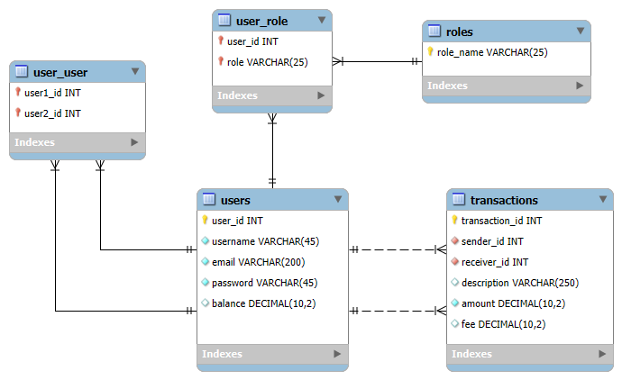

# PayMyBuddy

## Description
PayMyBuddy will be an application that makes money transfer between people very easy, unlike traditional bank transfers.
This repository contains the prototype of the application.

## Features

- Secured access
- User account based on email address
- Addition of other users as relations
- Modification of user infos

## Prerequisites
- Java 17
- Spring Boot 3.4.2
- Maven 3.9.9
- MySQL 8.4

## Installation
### Clone project
git clone <--URL-->

### Properties file
The properties file is not included in the repository for security reasons.
There is however a template in src/main/resources that can be used to create one.

### Physical Data Model

MySQL was used as DBMS. If another system is to be used, compatibility changes will need to be made.
Main database can be set up using the SQL file [database.sql](src/main/resources/Data_Model/database.sql).
There also is a test database (see Tests section).

## Tests
Tests are run using JUnit and SpringBootTest. They use a test DB (SQL file in test/resources).
JaCoCo is used for coverage assessment and Surefire for reporting.